::: {.hidden}
$$
\newcommand{\bup}[1]{\mathbf{#1}}
$$
:::

# P01. ODE — A Particle Problem

## Problem

::: {.question}
Set up (define system, draw FBD, write ODEs) a particle problem. Just one particle. 2D or 3D, your choice. Use a force, or forces that you like (gravity, spring, air friction). Any example of interest. Find a numerical solution. Graph it. Animate it. Try to make an interesting observation.
:::

## ODE

Random ODE solved via custom Euler solver.

```matlab
F1 = sin(t) * i_hat + cos(t) * j_hat;
F2 = cos(t) * i_hat + sin(t) * j_hat;

xdot = v;
vdot = F1 + F2;
```

## Trajectory

For the initial conditions of `x,y,vx,vy = z0 = [0, 0, 0.5, -0.5];`


::: {layout-ncol=2}
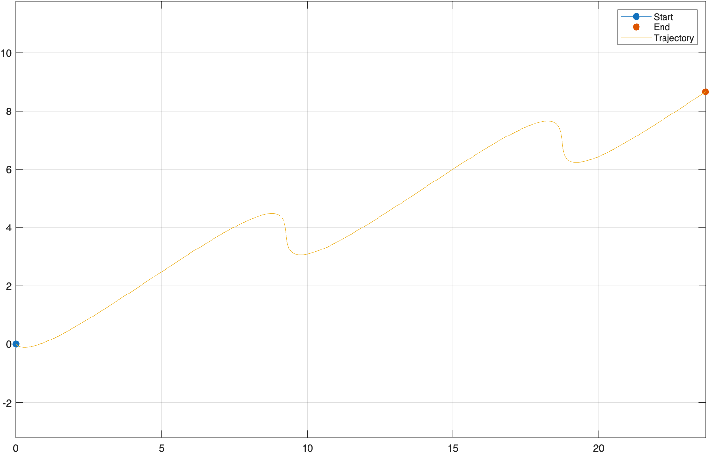


:::

# P02. Vectors in 3D

::: {.question}
Given four random points $\bup{r}_A, \bup{r}_B, \bup{r}_C, \bup{r}_D$ and a
force $\bup{F}$, write single vector formulas for:

(a) the minimum distance between lines $AB$ and $CD$
(b) the end points of that shortest segment
(c) the volume of tetrahedron $ABCD$ (derive "⅓ base × height")
(d) the tension in bar $AD$ when $A, B, C$ are fixed and connected by rods to $D$, where $\bup{F}$ is applied.
:::

# P03. More ODE & Animation Practice

::: {.question}
Pick a simple ODE system (harmonic oscillator, pendulum, Lorenz …) and solve it
three ways:

(a) a single script with a plain Euler loop
(b) your own Euler solver function calling a RHS function
(c) ODE45
(d) study accuracy vs. step size with Euler
(e) vary `RelTol`/`AbsTol` in ODE45 to judge whether MATLAB estimates its own accuracy well.
:::

## System

A damped 1D spring–mass: $m = 10$ kg, $k = 100$ N/m, rest length $L_0 = 2$ m,
damper $b = 10$ Ns/m, starting at $x_0 = 1$ m, $\dot{x}_0 = 1$ m/s.

$$
\dot{x} = v_x, \qquad \dot{v}_x = -\frac{k}{m}(x - L_0) - \frac{b}{m} v_x
$$

## (a)–(c) Three Solutions

All three methods give the same under-damped decay onto $x = L_0 = 2$
(Euler runs use $h = 10^{-3}$).

::: {.panel-tabset}
### (a) Single-script Euler


### (b) Euler solver + RHS function

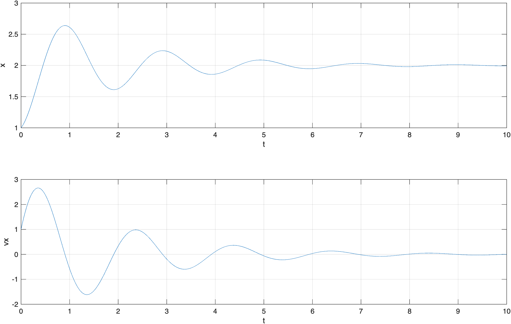

### (c) ODE45


:::

## (d) Accuracy vs. Step Size

The system is solved with the Euler solver for $h = 10^{-8}, 10^{-7}, \dots, 10^{1}$.
The finest run ($h = 10^{-8}$) is taken as the "exact" answer and the error in
$x(t_f = 10)$ of every other run is measured against it — no analytical solution needed.

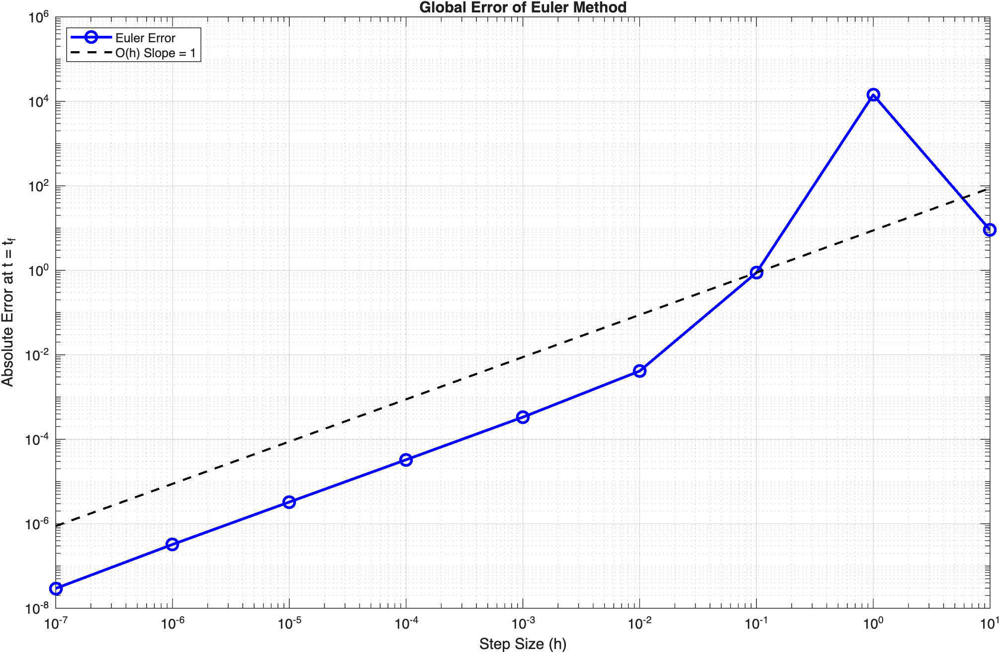{width=80%}

- For $h \le 10^{-2}$ the error falls on a line of slope 1, i.e. Euler's global error is $O(h)$:
  every 10× smaller step buys one more correct digit.
- For $h \gtrsim 0.1$ the method stops converging; at $h = 1$ the solution blows up
  (forward Euler is unstable once $h$ is comparable to the oscillation time scale
  $\sqrt{m/k} \approx 0.3$ s).

# P06. Spring and Mass (2D)

::: {.question}
A mass $m$ on a spring $(k, L_0)$ pinned at the origin, under gravity, starting
from $\bup{r}_0, \bup{v}_0$.

(a) Find the EoM
(b) plot and animate the trajectory
(c) list and carry out as many sanity checks as possible (e.g. $k = 0$ → ballistics; $x_0 = v_{x0} = 0$ → stays on the $y$-axis; $g = 0, \bup{v}_0 = 0$ → radial harmonic oscillation; $L_0 = 0$ → …).
:::

## (a) Equations of Motion

With $\ell = |\bup{r}|$ and $\hat{\bup{\lambda}} = \bup{r}/\ell$ the unit vector from the anchor to the mass:

$$
\dot{\bup{r}} = \bup{v}, \qquad
m\dot{\bup{v}} = -k(\ell - L_0)\,\hat{\bup{\lambda}} - mg\,\hat{\bup{\jmath}}
$$

## (b), (c) Trajectories and Sanity Checks

::: {layout-ncol=2}
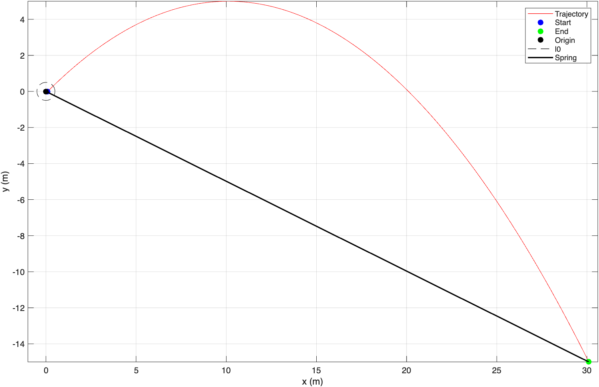


:::

**$L_0 = 0$ check.** With zero rest length the spring force is just $-k\bup{r}$, so the
EoM separate into $m\ddot{x} = -kx$ and $m\ddot{y} = -ky - mg$: two independent harmonic
oscillators with the same frequency $\sqrt{k/m}$, centred on $(0, -mg/k) = (0, -1)$. Released
from rest, both start at the extreme of their swing in phase, so the mass oscillates along the
straight line through $(1, 0)$ and $(0, -1)$, reaching the mirror point $(-1, -2)$ — which is
what the simulation shows.

# P07. Simple Animation of a Shape

::: {.question}
Draw an object (face, house, …) and make it move smoothly and interestingly on screen using only rigid motions — translations and rotations, no distortion.
:::

I defined a rectangle with 4 points and applied these transformations: \
1. translate by $\vec{T} = (2 2)^T$ 
2. rotate by $45^\circ$ using rotation matrix. 

Once we have initial and final coordinates of the shape, I linearly interpolate
them from time 0 to some time tf within which the animation occurs.

{width=70%}


# P08. Simplest Dynamics in Polar Coordinates

::: {.question}
A force-free particle on a plane, posed in polar coordinates:

(a) write $\bup{a} = \bup{0}$ as ODEs in $(r, \theta)$
(b) solve numerically for various ICs
(c) check the path is a straight line at constant speed
(d) define a quantitative "straightness" measure and evaluate it
(e) does it improve as tolerances are tightened?
:::

The equations of motion for this problem come out to be:

$\ddot{r} = r \dot{\theta}^2$

$\ddot{\theta} = -2\frac{r \dot{r}\dot{\theta}}{r}$

Numerical solution at 
```matlab
r0        = 1;
theta0    = 10 * pi/180;
rdot0     = 1;
thetadot0 = 1;
```


For the straightness check we compare the solution with the solution $\vec{r}(t)= vec{r}(0) + vec{v}t$


# P09. Cannon Ball (Linear Drag)

::: {.question}
A cannon ball launched at angle $\theta$ and speed $v_0$ with gravity and linear viscous drag $|cv|$.

(a) Analytical $x(t), y(t)$
(b) numerical solution for $\theta = \pi/4$, $v_0 = g = m = c = 1$
(c) compare — error at $t = 2$ vs. tolerances
(d) trajectories as $v_0 \to \infty$ — what shape?
(e) where does the range-maximising angle $\theta^*$ tend as $v_0 \to \infty$?
:::

## Equations of Motion

$$
\dot{\bup{r}} = \bup{v}, \qquad m\dot{\bup{v}} = -c\,\bup{v} - mg\,\hat{\bup{\jmath}}
$$

Integrated with ODE45 from the origin, with an event function that stops the
integration when the ball comes back down to $y = 0$.

## Numerical Trajectory

Run with $\theta = 45^\circ$, $v_0 = 10$, $m = 1$, $g = 10$, $c = 10$ (heavy drag):

{width=80%}

The path is far from a parabola: the ball rises almost in a straight line, then drops
nearly vertically. With linear drag the horizontal velocity decays as
$v_x = v_0\cos\theta\, e^{-ct/m}$, so $x$ can never exceed
$x_\infty = m v_0 \cos\theta / c = 0.707$ — the vertical asymptote the trajectory runs into.

# P11. Central Force

::: {.question}
Only force is central, $\bup{F} = -F(r)\,\hat{\bup{e}}_r$.

(a) Find $F(r)$ such that, across circular orbits, the speed is independent of radius.
(b) Numerically (with `fsolve` over ICs and period) find a periodic orbit that is neither circular nor straight, for a force law other than a linear spring or inverse-square gravity; comment on chaotic-looking failed searches and on the minimum number of loops for power laws.
:::

{width=50%}

## Periodic Solutions

### For $F(r) = 1$

Found using fsolve root finding
with initial conditions -    [ 4.837094489229557 0.113739688509354 0.481812323218859 1.333913034846417 ]
time period =   49.578757824567518

Using jacobian analysis, we find this is an unstable periodic motion.
eigvals of jacobian = [   0.786327175145648 0.786327175145648 1.187326408237210 0.842228377131789]

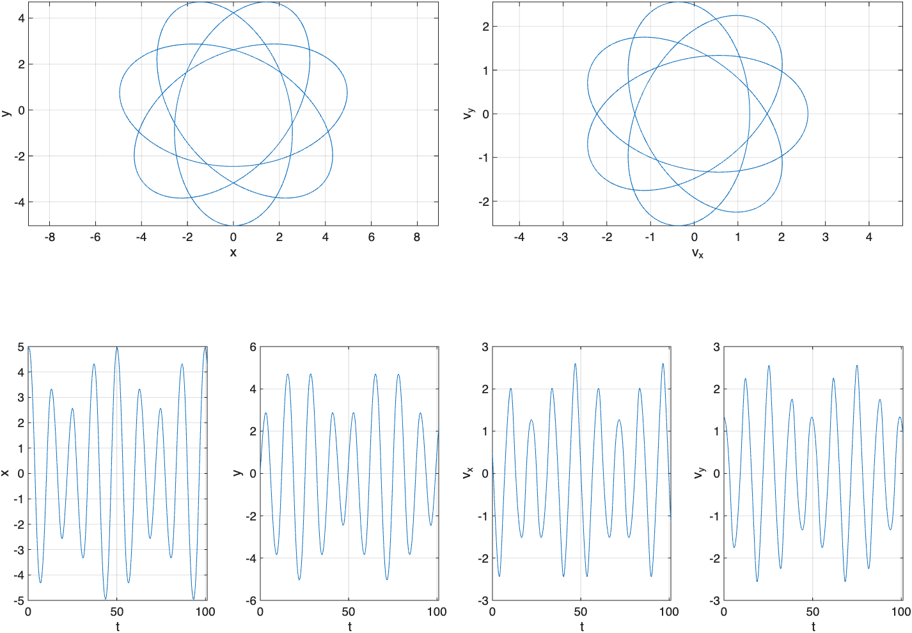{width=80%}

# P12. Canon Ball 2 (Quadratic Drag)

::: {.question}
A cannon ball $m$ is launched at angle $\theta$ and speed $v_0$. It is acted on
by gravity $g$ and a quadratic drag with magnitude $|cv^2|$.

(a) Find a numerical solution using $\theta = \pi/4$, $v_0 = 1$ m/s, $g = 1$ m/s², $m = 1$ kg.
(b) Numerically calculate (by integrating $\dot{W} = P$ along with the state variables) the work done by the drag force. Compare this with the change of the total energy. Make a plot showing that the difference between the two goes to zero as the integration gets more and more accurate.
:::

# P13. Statics vs Dynamics — Two Spring Damper System

::: {.question}
A 2D point mass under gravity, connected to anchors $A$ and $B$ by springs $(k_A, L_A), (k_B, L_B)$ with parallel dashpots $(c_A, c_B)$ and air drag $c_d$.

(a) Find an equilibrium.
(b) Simulate the motion.
(c) Find **all** equilibria and the most/least number possible as parameters vary.
(d) Determine stability both by simulation near the equilibrium and by eigenvalues of the linearised system.
:::

## Intro

System animation, fixed point analysis and clustering, and linear stability analysis for the **Two Spring and Two Damper System** with drag.

## Problem and Dynamics:

{width=70%}

## Fixed Points

The fixed points were found using `fsolve`, and clustering of fixed points was performed by using the following algorithms:

1. KMeans: within cluster sum of squares was found was varying K and the best K was determined by the elbow method.
2. DBScan: the distance parameter was kept very small (0.005) which converged correctly for every scenario I tried (except the infinite fixed point cases).

### Fixed Points = 2

::: {layout="[35,65]" layout-valign="center"}
```matlab
% System Constants
p.m = 1;
p.g = 10;

p.b1 = 1;
p.b2 = 1;

p.d = 0.6; % drag coef

p.k1 = 1;
p.k2 = 10;
p.l1_0 = 1;
p.l2_0 = 1;

p.r1 = [-1; 0];
p.r2 = [1; 0];
```


:::

Both KMeans and DBScan provided the right answer for this.

### Fixed Points = 5

::: {layout="[35,65]" layout-valign="center"}
```matlab
% System Constants
p.m = 1;
p.g = 0;

p.b1 = 1;
p.b2 = 1;

p.d = 1; % drag coef

p.k1 = 10;
p.k2 = 10;
p.l1_0 = 1.5;
p.l2_0 = 1.5;

p.r1 = [-1; 0];
p.r2 = [1; 0];
```


:::

::: {layout-ncol=2}


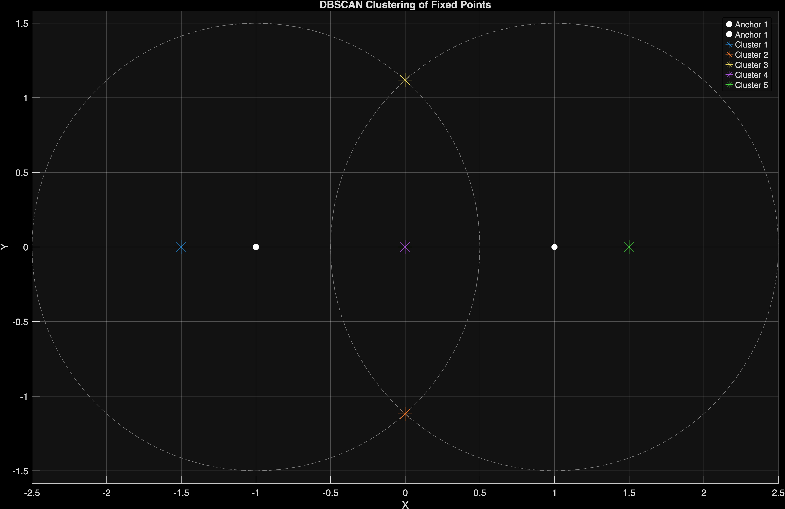
:::

### Fixed Points = 1

::: {layout="[35,65]" layout-valign="center"}
```matlab
% System Constants
p.m = 1;
p.g = 10;

p.b1 = 1;
p.b2 = 1;;

p.d = 1; % drag coef

p.k1 = 10;
p.k2 = 10;
p.l1_0 = 1;
p.l2_0 = 1;

p.r1 = [-1; 0];
p.r2 = [1; 0];
```

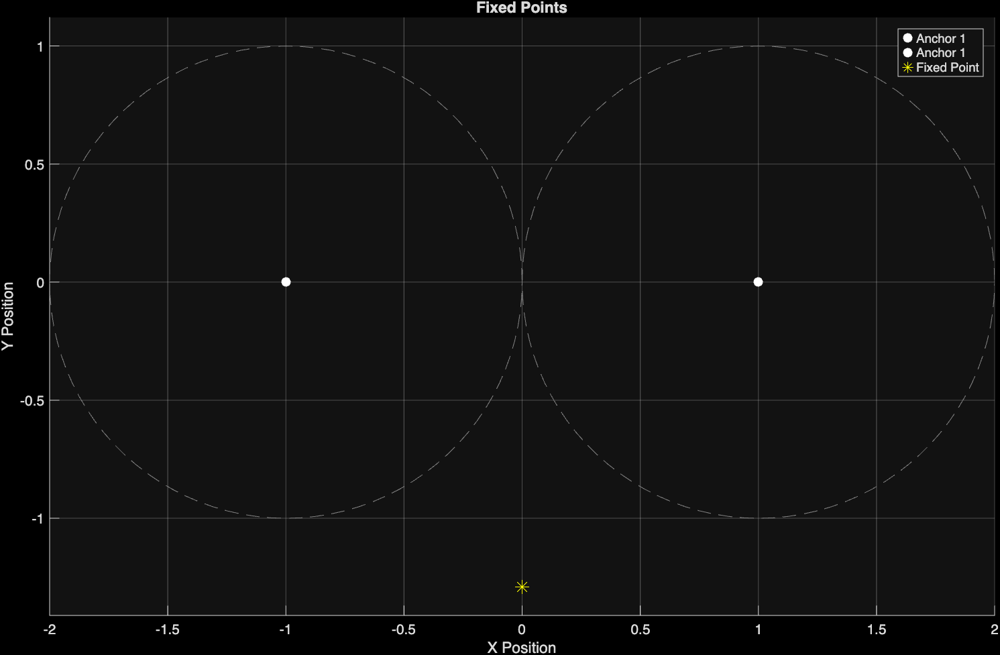
:::

Both KMeans and DBScan provided the right answer for this.

### Fixed Points = 4, Two of them are very close

::: {layout="[35,65]" layout-valign="center"}
```matlab
% System Constants
p.m = 1;
p.g = 0;

p.b1 = 1;
p.b2 = 1;;

p.d = 1; % drag coef

p.k1 = 10;
p.k2 = 10;
p.l1_0 = 1;
p.l2_0 = 1;

p.r1 = [-1; 0];
p.r2 = [1; 0];
```


:::

{width=50%}

::: {layout-ncol=2}


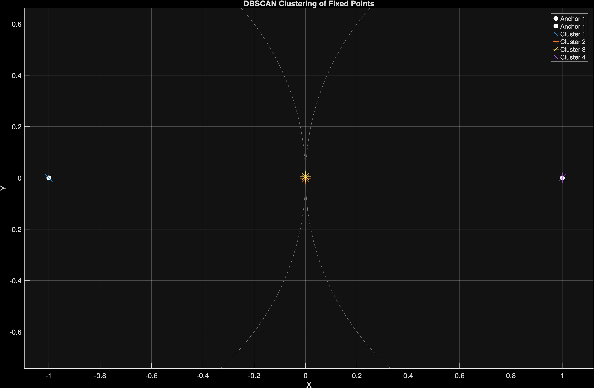
:::

### Fixed Points = 3

::: {layout="[35,65]" layout-valign="center"}
```matlab
% System Constants
p.m = 1;
p.g = 1;

p.b1 = 1;
p.b2 = 1;

p.d = 1; % drag coef

p.k1 = 1;
p.k2 = 1;
p.l1_0 = 1;
p.l2_0 = 2;

p.r1 = [-1; 0];
p.r2 = [1; 0];
```


:::

DBScan was correct all the times, KMeans sometimes said best K was 2, while other times said it was 3.

### Fixed Points = Infinite

When gravity is off, and either of the spring constants are zero, all points on the free length circle of the active spring are valid unique fixed points.

{width=50%}

Also when gravity is off, and both the springs are active, but the anchor positions are the same, we get infinite fixed points.

{width=50%}

## Linearised Motion

**Task:**

- Using the Jacobian supplied by fsolve at one of the stable fixed points, solve the linearized equations for motion for an initial condition near the fixed point.
- Using the same initial condition, use ODE45 to find the motion.
- Repeat for an unstable fixed point

**System Used:**
The same parameters that resulted in 3 fixed points were used.

Stable Fixed Points:

- [-1; 0]
- [-0.5323; -1.7316]

Unstable Fixed Points:

- [1.2412; 0.2169]

### Response near stable fixed point

{width=60%}

### Response near unstable fixed point

{width=60%}

### Response When L0 = 0, b = 0

::: {layout-ncol=2}


:::

# P14. What Means "Rate of Change of Angular Momentum"?

::: {.question}
For a moving particle $P$ and a moving reference point $C$, decide for which definition of $\bup{H}_{/C}$ the equation $\bup{M}_C = \dot{\bup{H}}_{/C}$ holds (i.e. is consistent with $\bup{F} = m\bup{a}$) — in general, or only in special cases?

(a) $\bup{H}_{/C} = \bup{r}_{P/C'} \times \bup{v}_{P/0}\, m$, with $C'$ fixed and instantaneously coincident with $C$
(b) $\bup{H}_{/C} = \bup{r}_{P/C} \times \bup{v}_{P/0}\, m$
(c) $\bup{H}_{/C} = \bup{r}_{P/C} \times \bup{v}_{P/C}\, m$
:::

<embed src="14_AngularMomentum/P14_AngularMomentum.pdf" type="application/pdf" width="100%" height="900px">

# P15. Potential Energy

::: {.question}
Find the potential-energy function for each of these 3D force fields, verifying the given answers with multivariable calculus:

(a) constant force
(b) zero-rest-length spring
(c) spring with rest length
(d) inverse-square central force
(e) general central force $f(r)$
(f) spring between two points
(g) inverse-square attraction between two points
(h) constant force along $\hat{\boldsymbol{\lambda}}$
(i) an $x$-only force $f(x)$
:::

<embed src="15_PotentialFunction/P15_PotentialFunction.pdf" type="application/pdf" width="100%" height="900px">

# P16. Mechanics of Two or More Particles

::: {.question}
(a) For two unequal particles $m_1$ and $m_2$ a distance $d$ apart, attracted only by Newtonian gravity $F = Gm_1m_2/r^2$, what is the period of circular motion?
(b) Pick numbers for $G, m_1, m_2, d$ and test the analytical result with a numerical simulation; make plots that convincingly show the agreement.
(c) For three equal particles, $m = 1$, $G = 10$, what is the angular speed for circular motion on a circle of diameter $d = 3$?
(d) Check the three-particle result with a numerical simulation.
:::

## (a) Period of the Two-Body Circular Orbit

Both masses circle the centre of mass at the same $\omega$. Writing $\bup{r} = \bup{r}_2 - \bup{r}_1$,
momentum conservation about the (fixed) COM gives $\bup{r}_1 = -\frac{m_2}{m_1+m_2}\bup{r}$, so
circular motion $\ddot{\bup{r}}_1 = -\omega^2\bup{r}_1$ plugged into $m_1\ddot{\bup{r}}_1 = \frac{Gm_1m_2}{r^2}\hat{\bup{r}}$ gives

$$
\omega^2 = \frac{G(m_1 + m_2)}{d^3}
\quad\Rightarrow\quad
T = 2\pi\sqrt{\frac{d^3}{G(m_1 + m_2)}}
$$

{width=85%}

## (b) Numerical Check

The masses start a distance $d$ apart on the $x$-axis, with velocities
$\bup{v}_i = \omega\,(x_i - x_{\text{COM}})\,\hat{\bup{\jmath}}$ from the formula above,
and are integrated with ODE45 (`RelTol = AbsTol = 1e-8`) for exactly $3T$.

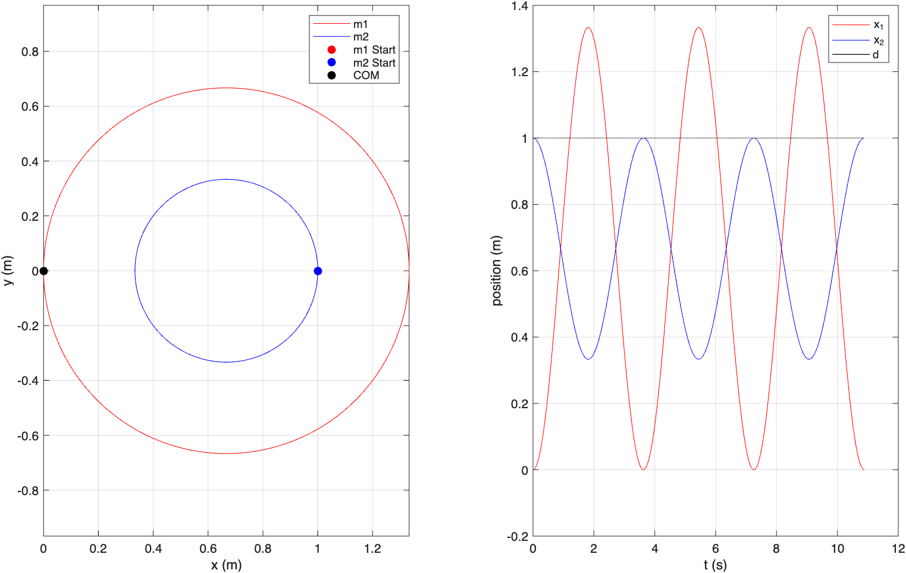

The orbit closes on itself after each predicted period and the separation never drifts,
so the simulation agrees with $T = 2\pi\sqrt{d^3/G(m_1+m_2)}$.

# P17. Montgomery's Eight

::: {.question}
Three equal masses $m = 1$ attract each other by inverse-square gravity with $G = 1$. Start them at

$$(x_1, y_1) = (-0.97000436,\ 0.24308753), \quad (x_2, y_2) = (-x_1, -y_1), \quad (x_3, y_3) = (0, 0)$$

with velocities

$$(v_{x3}, v_{y3}) = (0.93240737,\ 0.86473146), \quad (v_{x1}, v_{y1}) = (v_{x2}, v_{y2}) = -(v_{x3}, v_{y3})/2.$$

(a) Integrate and plot the motion of each particle in a different colour for 2.1 time units.
(b) Same, but run for 10 time units.
(c) Same, but change the initial conditions slightly.
(d) Same, but change the initial conditions more and run for a much longer time.
:::

## Equations of Motion

For each body $i$ with the other two $j, k$:

$$
m_i\ddot{\bup{r}}_i = \sum_{j \ne i} \frac{G m_i m_j}{|\bup{r}_j - \bup{r}_i|^3}\,(\bup{r}_j - \bup{r}_i)
$$

The 12-state system $[\bup{r}_1, \bup{r}_2, \bup{r}_3, \bup{v}_1, \bup{v}_2, \bup{v}_3]$ is integrated with ODE45.

## (a) 2.1 Time Units

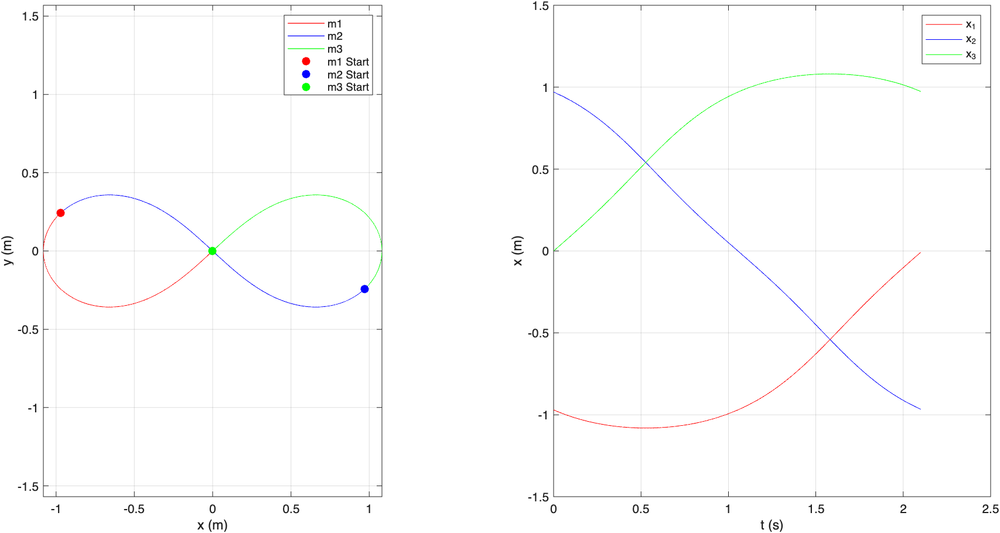

## (b) 10 Time Units

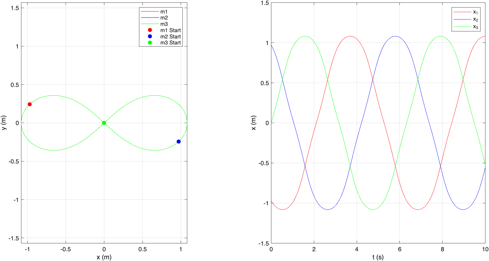

## (c) Small Perturbation

Adding $0.1$ to $v_{x3}$:


## (d) Large Change in Initial Conditions

Bodies started at $(1, 0), (0, 1), (0, 0)$ with velocities $(0, 1), (-1, 0), (0, 0)$:

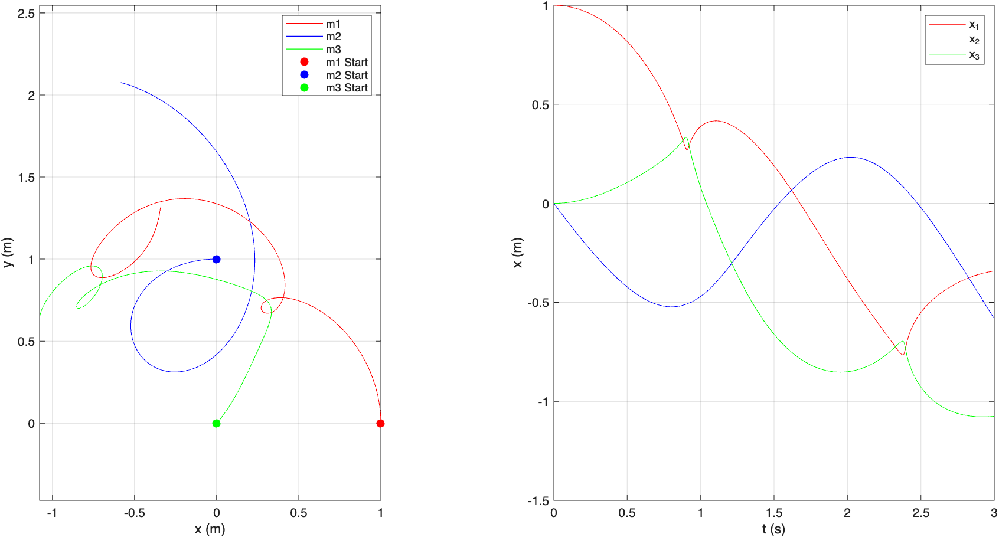

# P18. König's Theorem

::: {.question}
The total kinetic energy of a system of particles is $E_K = \frac{1}{2}\sum m_i v_i^2$.

(a) Derive an expression of the form $E_K = \frac{1}{2} m_{\text{tot}} v_G^2 + \dots$ (fill in the rest).
(b) Is it always true that $\sum \bup{F}_{\text{ext}} \cdot \bup{v}_G = \frac{d}{dt}\left(\frac{1}{2} m_{\text{tot}} v_G^2\right)$? Prove it or give a counter-example.
(c) Is it always true that the power of the internal forces equals the rate of change of the second half of the expression in (a)? Prove it or give a counter-example.
:::

## (a) Kinetic Energy About the Centre of Mass

Write each particle's position and velocity relative to the centre of mass $G$:
$\bup{r}_i = \bup{r}_G + \bup{r}_{i/G}$ and $\bup{v}_i = \bup{v}_G + \bup{v}_{i/G}$. Then

$$
E_K = \frac{1}{2}\sum m_i\left(\bup{v}_G + \bup{v}_{i/G}\right)^2
= \frac{1}{2} m_{\text{tot}} v_G^2 + \frac{1}{2}\sum m_i v_{i/G}^2 + \bup{v}_G \cdot \sum m_i \bup{v}_{i/G}
$$

The cross term vanishes because, by definition of the centre of mass,

$$
\sum m_i \bup{r}_{i/G} = \sum m_i \bup{r}_i - \bup{r}_G \sum m_i = m_{\text{tot}}\bup{r}_G - m_{\text{tot}}\bup{r}_G = \bup{0}
\quad\Rightarrow\quad
\sum m_i \bup{v}_{i/G} = \bup{0}
$$

so

$$
\boxed{E_K = \frac{1}{2} m_{\text{tot}} v_G^2 + \frac{1}{2}\sum m_i v_{i/G}^2}
$$

i.e. the kinetic energy of the total mass moving with $G$, plus the kinetic energy of the motion relative to $G$.

{width=85%}

# P00. Walking and Running (Point-Mass Model)

::: {.question}
Model a walker/runner as a point mass $m$ on a massless telescoping leg under gravity $g$.
During **stance** the foot is pinned to the ground and the leg pushes along its length with force $F(t)$;
during **flight** the body is ballistic. Find periodic gaits, and use trajectory optimisation to find
the gait that moves a distance $d$ per step at speed $v$ with the least positive leg work.
:::

## Model

With the foot at $(x_c, 0)$ and leg length $\ell = \sqrt{(x - x_c)^2 + y^2}$:

$$
\text{stance:}\quad m\ddot{x} = F\,\frac{x - x_c}{\ell}, \qquad m\ddot{y} = F\,\frac{y}{\ell} - mg
\qquad\qquad
\text{flight:}\quad \ddot{x} = 0, \qquad \ddot{y} = -g
$$

Each step is one stance phase of length $t_s$ followed by one flight phase of length $t_f$;
the next foot is placed so the step repeats. The script has four gaits: hand-picked ICs,
a **flat walk** (leg force chosen so the body stays at a constant height $h$, no flight phase),
a **run** with a sine-hump leg force, and **trajectory optimisation**.

## Trajectory Optimisation

Decision variables: the initial state $(x_0, y_0, \dot{x}_0, \dot{y}_0)$, the leg force at 11
grid points (linearly interpolated), and the stance time $t_s$. With
$m = g = \ell_{\max} = 1$, $d = 1$, $v = 1$ (so step time $= 1$), `fmincon` (SQP) solves

$$
\min\ \frac{\int_0^{t_s} \max(F\dot{\ell},\, 0)\, dt}{mgd}
\quad\text{s.t.}\quad
\bup{z}(t_{\text{step}}) = \bup{z}(0) + d\,\hat{\bup{\imath}}_x \ \text{(periodic)},\quad
\ell \le \ell_{\max},\quad 0 \le F \le F_{\max}
$$

i.e. the cost of transport counting only positive work (negative work is free). The flat walk
(cost $d/8h = 0.156$) is used as the initial guess.

**Result:** `fmincon` converged in 39 iterations to a cost of transport of **0.125** — about 20% cheaper
than the flat walk — with $t_s = 0.33$, $t_f = 0.67$. The optimiser abandoned walking and found a
**running** gait: a short, nearly constant push ($F \approx 3$–$3.4\,mg$) followed by a long flight.


# P20. Two Masses

::: {.question}
<!-- TODO: fill question -->
:::

Part A.
<!-- Put trajectory image -->

Part B.
With accuracy (reltol and abstol) in ode45 of 1e-3, or 1e-8, the RMS error and overall error curve between F_G and F_0 looks the same. This is expected as relatively the values of the numbers ode45 is solving (x, xdot) have both become more precise, but the difference between them should be the same.

<!-- TODO partb image -->


# P21. Two Masses Constrained

::: {.question}
Replace the spring of P20 with a rigid rod. Set up the DAEs and solve them in MATLAB with a
sinusoidally varying force $F$. Note any growing error in the constraint. Compare with the
P20 method (a very large $k$): which is faster to compute, and which predicts the COM motion more
accurately? Try initial conditions where the masses have unequal velocities, and explain the result.
:::

## Equations (DAE)

The rod holds $x_2 - x_1 = d$. With rod tension $T$ (FBDs below), LMB on each mass and the
constraint differentiated twice ($\ddot{x}_2 - \ddot{x}_1 = 0$) give three linear equations in
$\ddot{x}_1, \ddot{x}_2, T$:

$$
\begin{bmatrix} m_1 & 0 & -1 \\ 0 & m_2 & 1 \\ -1 & 1 & 0 \end{bmatrix}
\begin{bmatrix} \ddot{x}_1 \\ \ddot{x}_2 \\ T \end{bmatrix}
=
\begin{bmatrix} 0 \\ F(t) \\ 0 \end{bmatrix},
\qquad F(t) = F_0 \sin t
$$

which are solved with `A\F` at every RHS call and passed to `ode45`.
$m_1 = m_2 = 1$, $d = 1$, $F_0 = 1$, `RelTol = AbsTol = 1e-8`.

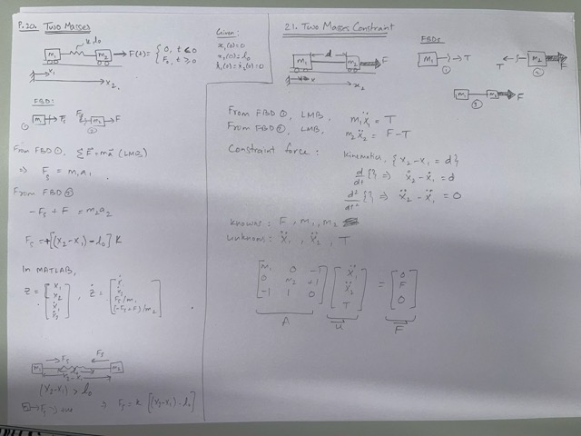{width=85%}

## Trajectory

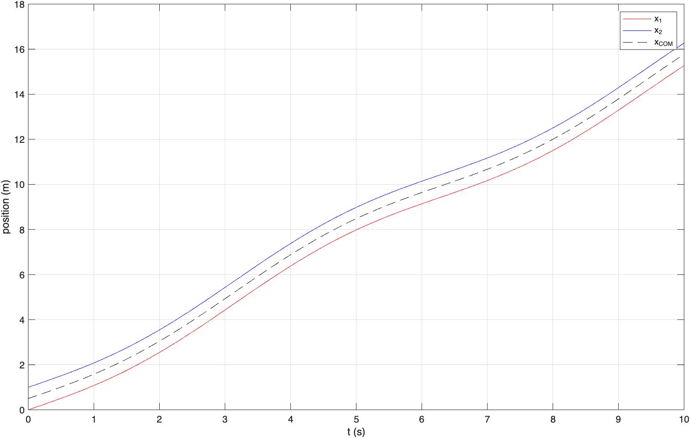

## Error in the Constraint

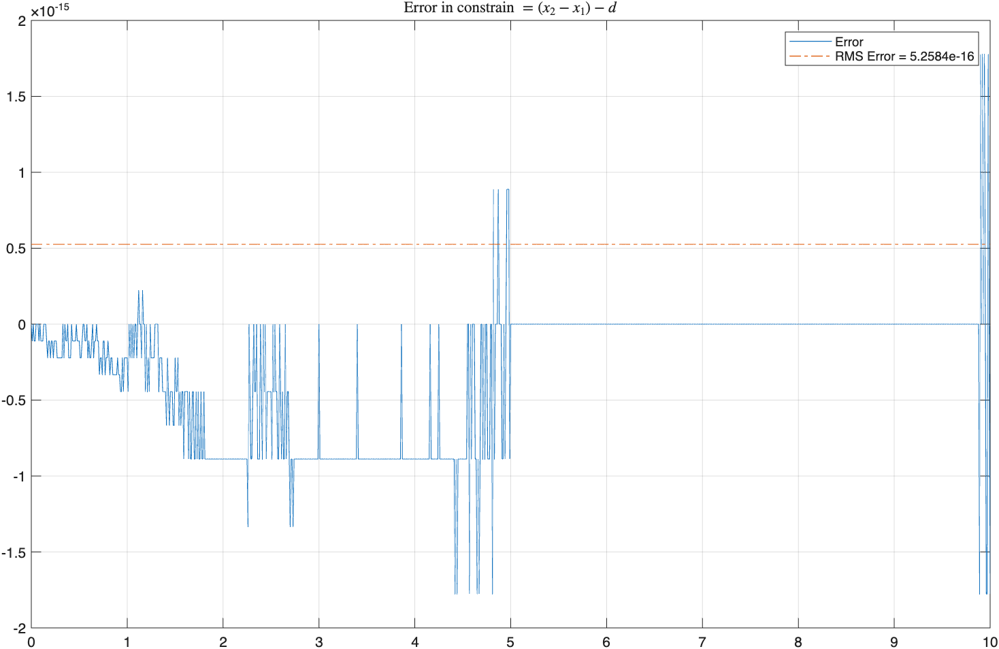

The error stays at round-off level ($\sim 10^{-15}$, RMS $5 \times 10^{-16}$) and does not grow
noticeably over 10 s. In this 1D problem the constraint is linear, so $\ddot{x}_2 - \ddot{x}_1 = 0$
is computed exactly (up to round-off) at every step and the relative velocity stays exactly zero:
there is nothing for the integrator to accumulate.

## Constraint vs. Stiff Spring ($k = 10^5$)

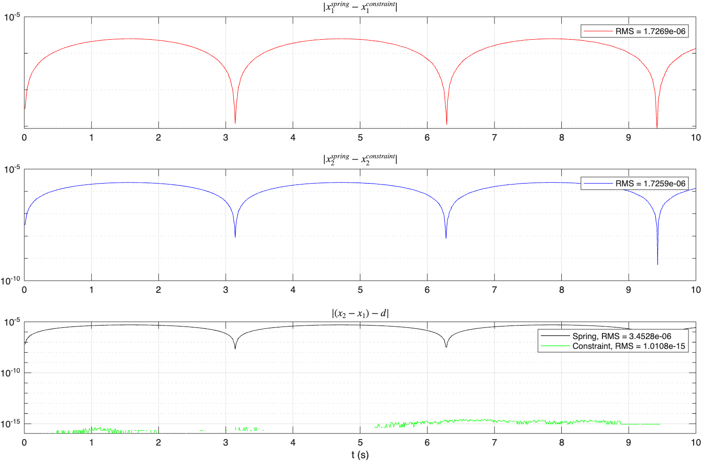

- **Accuracy of the constraint:** the spring lets the gap change by $\sim F/k \approx 10^{-5}$,
  while the DAE keeps it at $10^{-15}$. The two trajectories differ by about $10^{-6}$ to $10^{-5}$,
  i.e. by the stretch of the spring.
- **Speed:** averaged over 5 runs to $t_f = 10$ with the same tolerance $10^{-8}$:

  | Method | ode45 steps | Time |
  |---|---|---|
  | DAE (rigid rod) | 55 | 4.8 ms |
  | Stiff spring, $k = 10^5$ | 4143 | 53 ms |

  The DAE is about **10× faster**. The spring adds an oscillation with frequency
  $\sqrt{k(m_1 + m_2)/(m_1 m_2)} \approx 450$ rad/s, and `ode45` has to take tiny steps to follow
  it even though it has almost no amplitude. The rigid rod has no fast time scale.
- **COM motion:** for both methods the internal force cancels from
  $(m_1 + m_2)\ddot{x}_G = F$, so the COM is "right" in both models and any error is integration
  error only. Against the exact $x_G(10) = x_G(0) + (10 - \sin 10)/2$, the DAE run is off by
  $1.8 \times 10^{-9}$ (within the requested $10^{-8}$) and the spring run by $6 \times 10^{-15}$.
  The spring is not the better model here: its stiffness forces 75× more steps, and the small
  steps happen to make the slow COM motion very accurate. At equal cost, the DAE is the better buy.

## Unequal Initial Velocities

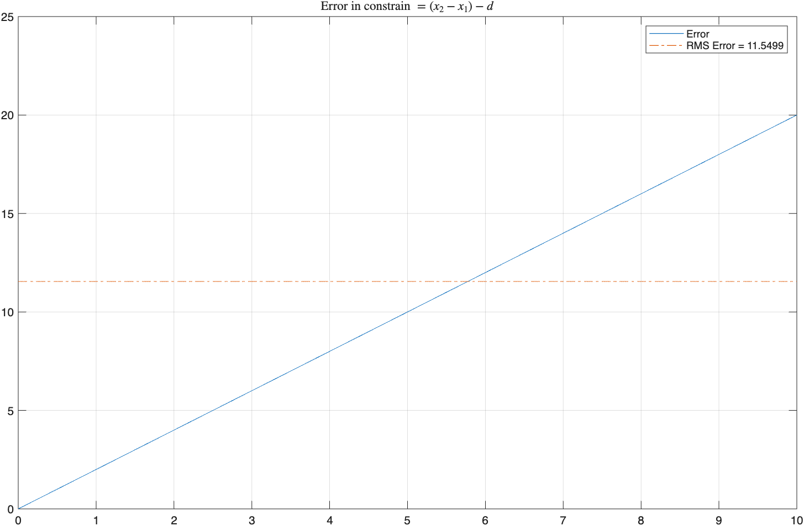

The "rod" now grows linearly at a rate of exactly 2 m/s. The DAE only enforces the
**acceleration** form of the constraint, $\ddot{x}_2 - \ddot{x}_1 = 0$. That keeps the relative
velocity constant, but it does not know what that constant should be. Initial conditions with
$\dot{x}_2 \ne \dot{x}_1$ are physically inconsistent with a rigid rod: a real rod would apply an
impulse at $t = 0$ to equalise the velocities. Without that, the solution keeps the initial relative
velocity forever, and $(x_2 - x_1) - d = (\dot{x}_2(0) - \dot{x}_1(0))\,t$.

# P22. Simple Pendulum

::: {.question}
Derive the simple pendulum equation $\ddot\theta + \frac{g}{\ell}\sin\theta = 0$ as many ways as you can,
in polar coordinates:

(a) linear momentum, manipulating the equations to eliminate the constraint force
(b) linear momentum, dot with $\hat{\bup{e}}_\theta$
(c) linear momentum, cross with $\bup{r}$
(d) angular momentum
(e) conservation of energy
(f) power balance
(g) Lagrange equations (if you know them already).
:::

$\theta$ is measured counter-clockwise from the horizontal $+x$ axis, so $\bup{r} = \ell\,\hat{\bup{e}}_r$,
$\bup{v} = \ell\dot\theta\,\hat{\bup{e}}_\theta$ and $\bup{a} = \ell\ddot\theta\,\hat{\bup{e}}_\theta - \ell\dot\theta^2\,\hat{\bup{e}}_r$.
The forces are the rod tension $-T\hat{\bup{e}}_r$ and gravity $-mg\hat{\bup{\jmath}}$. With this
convention every method gives

$$
\ddot\theta + \frac{g}{\ell}\cos\theta = 0
$$

which is the requested equation with $\theta$ measured from the downward vertical instead
($\theta_{\text{down}} = \theta + \pi/2$, so $\cos\theta = \sin\theta_{\text{down}}$).

| Method | Key step |
|---|---|
| (a) LMB, eliminate $T$ | $-T\hat{\bup{e}}_r - mg\hat{\bup{\jmath}} = m(\ell\ddot\theta\,\hat{\bup{e}}_\theta - \ell\dot\theta^2\hat{\bup{e}}_r)$. I did not find a way to eliminate $T$ other than the projections below. |
| (b) LMB $\cdot\,\hat{\bup{e}}_\theta$ | $-mg\cos\theta = m\ell\ddot\theta$ |
| (c) $\bup{r} \times$ LMB | $-mg\ell\sin(90^\circ - \theta)\,\hat{\bup{k}} = m\ell^2\ddot\theta\,\hat{\bup{k}}$ |
| (d) AMB about $O$ | $\sum \bup{M}_{/O} = -mg\ell\cos\theta\,\hat{\bup{k}} = \dot{\bup{H}}_{/O} = m\ell^2\ddot\theta\,\hat{\bup{k}}$ |
| (e) Energy | $mg\ell\sin\theta + \tfrac{1}{2}m\ell^2\dot\theta^2 = \text{const}$; differentiate and divide by $\dot\theta$ |
| (f) Power | $(-T\hat{\bup{e}}_r - mg\hat{\bup{\jmath}}) \cdot \ell\dot\theta\,\hat{\bup{e}}_\theta = \frac{d}{dt}\left(\tfrac{1}{2}m\ell^2\dot\theta^2\right)$ |
| (g) Lagrange | not done |

<embed src="22_SimplePendulum/imgs/P22.SimplePendulum.pdf" type="application/pdf" width="100%" height="900px">

# P23. Pendulum Numerics

::: {.question}
Set up the pendulum in Cartesian coordinates. Express the constant-length constraint as linear
equations restricting the acceleration, and solve these DAEs numerically (no polar coordinates).
Compare quantitatively with a solution of the simple pendulum equation, and integrate long enough
to detect drift away from the kinematic constraint.
:::

## Equations

With $\bup{r} = x\hat{\bup{\imath}} + y\hat{\bup{\jmath}}$ and tension $T$ along $-\bup{r}/\ell$, LMB in
$x$ and $y$ plus the length constraint $x^2 + y^2 = \ell^2$ differentiated twice
($x\ddot{x} + y\ddot{y} = -\dot{x}^2 - \dot{y}^2$) give

$$
\begin{bmatrix} m & 0 & x/\ell \\ 0 & m & y/\ell \\ x & y & 0 \end{bmatrix}
\begin{bmatrix} \ddot{x} \\ \ddot{y} \\ T \end{bmatrix}
=
\begin{bmatrix} 0 \\ -mg \\ -\dot{x}^2 - \dot{y}^2 \end{bmatrix}
$$

The reference solution is $\ddot\theta = -\frac{g}{\ell}\cos\theta$ (P22, $\theta$ from the horizontal),
mapped to Cartesian with $x = \ell\cos\theta$, $y = \ell\sin\theta$.

$m = 1$, $\ell = 1$, $g = 10$, released from rest at $\theta_0 = 30^\circ$ (above the horizontal),
`ode45` with `RelTol = AbsTol = 1e-5`, $t_f = 100$.

<embed src="23_PendulumNumerics/imgs/P23.PendulumNumerics.pdf" type="application/pdf" width="100%" height="900px">

## DAE vs. Simple Pendulum

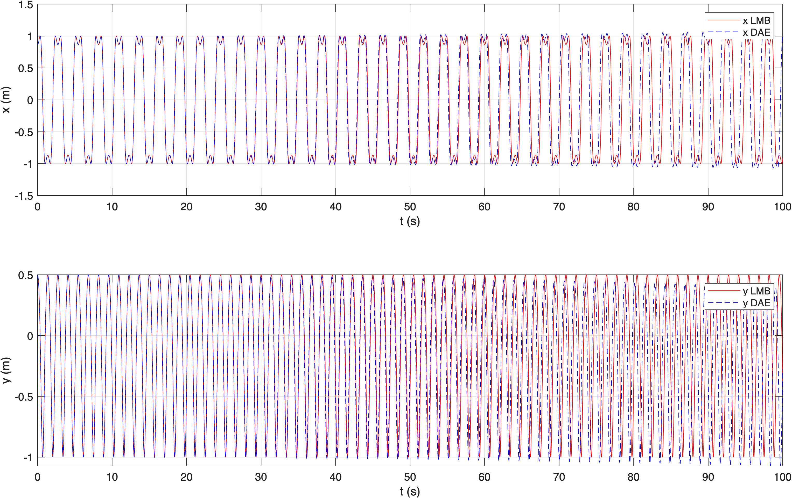

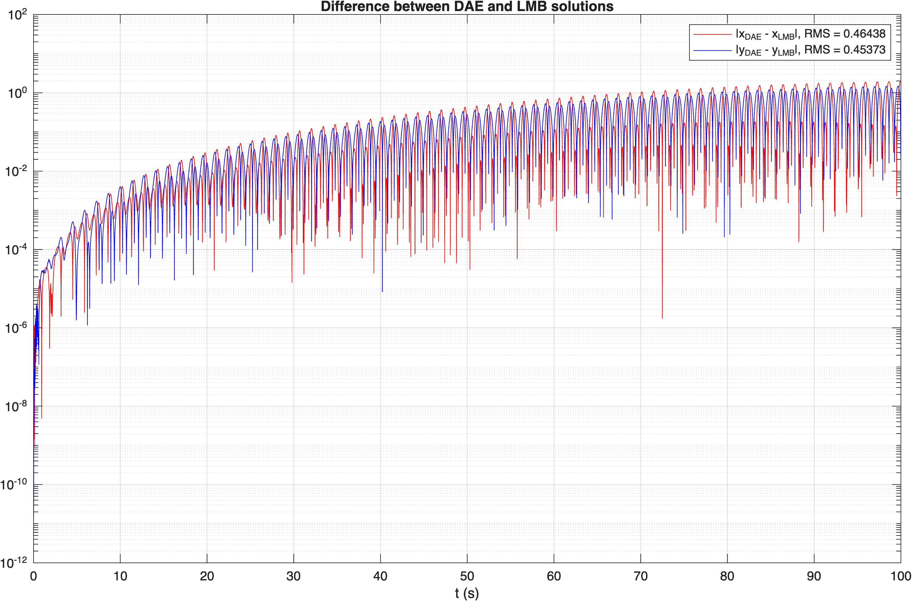

The two solutions agree to about $10^{-6}$ at first. The difference then grows steadily and reaches
order 1 (the size of the pendulum) after about 70–100 s, with RMS $\approx 0.46$ over the run. The
DAE pendulum is slowly getting longer (below), so its period changes and the error is mostly a
**phase** error: the two bobs swing the same way but are no longer in step.

## Constraint Drift

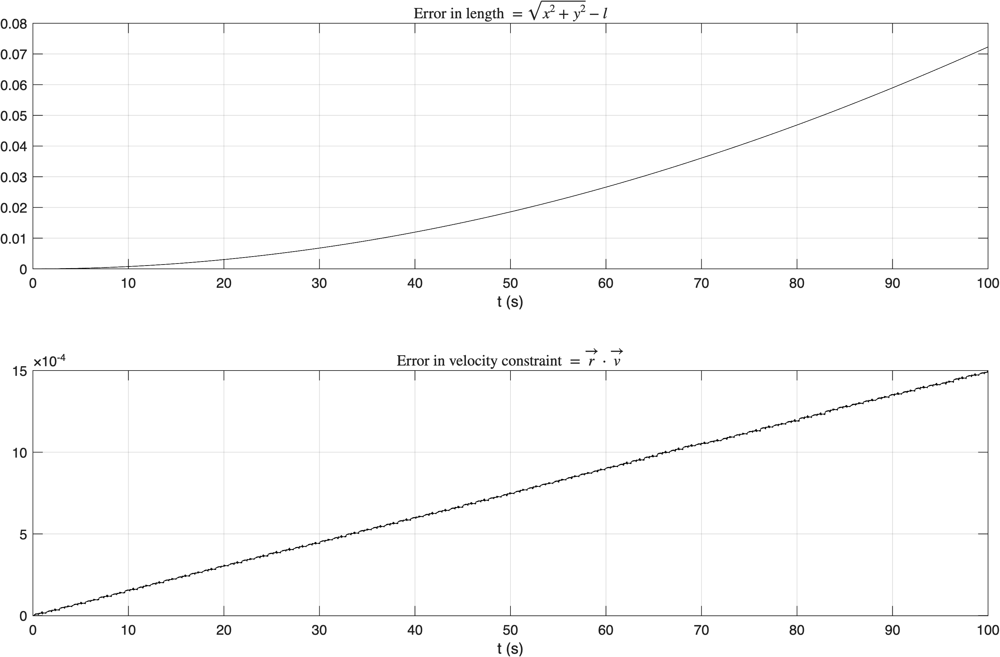

- $\bup{r} \cdot \bup{v}$ (should be 0) grows **linearly**, to $1.5 \times 10^{-3}$ at $t = 100$.
  Only the acceleration constraint is enforced, so every small integration error in the velocity
  constraint is kept and nothing pulls it back (the same mechanism as the unequal velocities in P21).
- The length error grows **quadratically**, to $0.072$ at $t = 100$. This follows from the line above:
  $\frac{d}{dt}(x^2 + y^2) = 2\,\bup{r} \cdot \bup{v} \approx 2ct$, so $x^2 + y^2 - \ell^2 \approx ct^2$.
  With $c = 1.5 \times 10^{-5}$, this predicts $|\bup{r}| - \ell \approx 0.075$ at $t = 100$, which
  matches the plot.

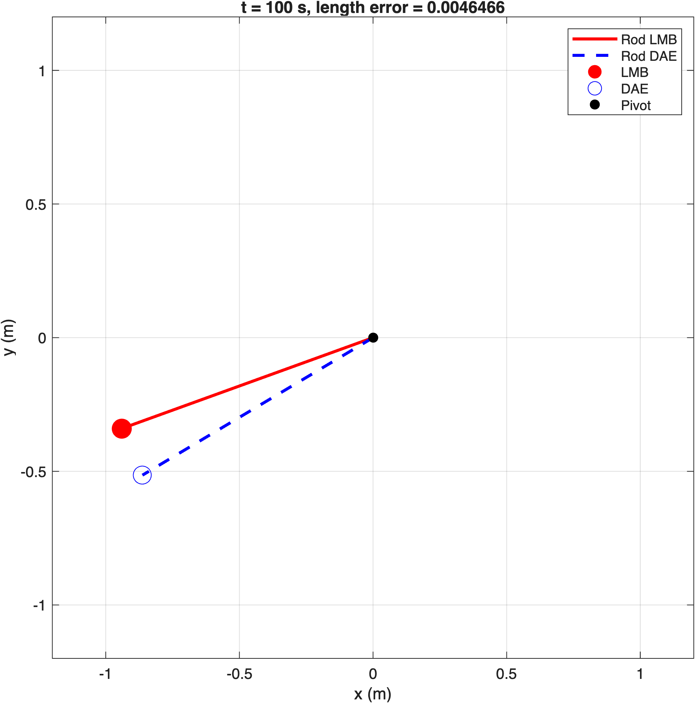{width=60%}

# P26. Rotation with Zero Angular Momentum

::: {.question}
A massless rigid plate floats in space with four equal masses on it. Two are fixed on the $y$ axis
at $y = \pm 2$. The other two are driven around circles of radius 1 centred at $x = \pm 2$ (starting
at $x = \pm 3$), always mirror images through the origin, with
$\theta = (1 - \cos t)\pi$ for $0 \le t \le \pi$. Use conservation of angular momentum
($\bup{H}_{/O} = \bup{0}$) to find the net rotation $\phi$ of the plate after one revolution.
:::

## Approach

Let $\phi$ be the rotation of the plate (frame $\hat{\bup{e}}_x, \hat{\bup{e}}_y$) relative to the
fixed frame, with $\bup{\omega} = \dot\phi\,\hat{\bup{k}}$. Each mass's acceleration is found with the
five-term formula

$$
\bup{a}_{/F} = \bup{a}_{O/F} + \bup{a}_{/O} + 2\bup{\omega} \times \bup{v}_{/O} + \dot{\bup{\omega}} \times \bup{r}_{/O} + \bup{\omega} \times (\bup{\omega} \times \bup{r}_{/O})
$$

- **Masses 1, 2** (fixed on the plate at $\pm 2\hat{\bup{e}}_y$): $\dot{\bup{H}}_{i/O} = 4m\ddot\phi\,\hat{\bup{k}}$ each.
- **Masses 3, 4** (on the circles, $\bup{r}_{3/O} = 2\hat{\bup{e}}_x + \hat{\bup{e}}_{r_B}$, where $\hat{\bup{e}}_{r_B}$ is at angle $\theta$): $\dot{\bup{H}}_{3/O} = \dot{\bup{H}}_{4/O}$ by symmetry.

Summing and setting $\sum\dot{\bup{H}}_{i/O} = \bup{0}$ (no external moments) gives a second-order
equation for $\phi$. 

The below work tries to do that by hand which of course resulted in a wrong
answer and the EoM derived by hand are not correct.

<embed src="26_RotationWithoutH/imgs/Derivation.pdf" type="application/pdf" width="100%" height="900px">

The same approach was used to find the EoM symbolically and animate the system
and find the below trajectories. 

## Result

<!-- TODO: add phi(t) plot and the net rotation phi(pi) -->

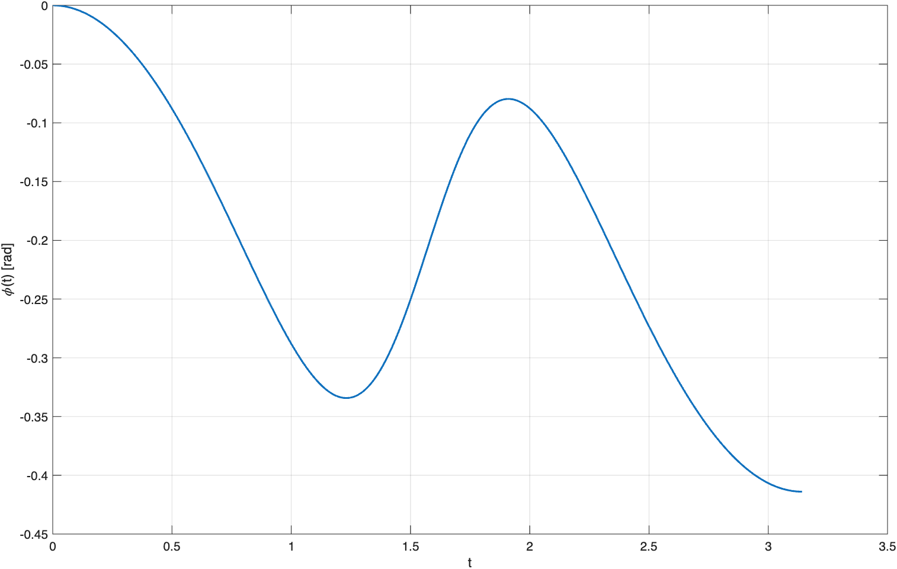

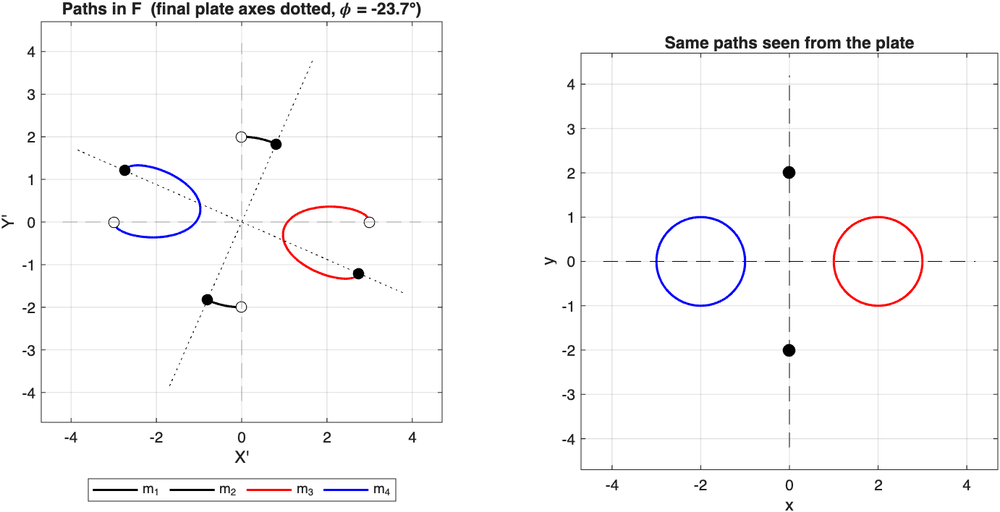

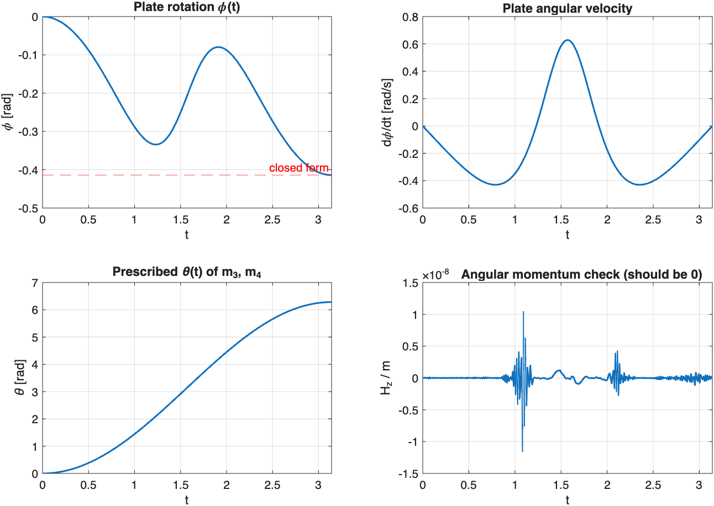

# P31. Double Pendulum (2D)

::: {.question}
A double pendulum is made of two bars with hinges at the origin $O$ and the elbow $E$; $g = 1$, no friction, no
joint motors.

(a) Set up and numerically solve the governing equations found with AMB. Start with the upper arm horizontal to
the right and the forearm vertical up; integrate to $t = 30$ and draw the trajectory of the end of the forearm
(equal uniform bars of length 1, $g = 1$).
(b) Solve again with DAEs and show by comparison that the equations are the same as from AMB.
(c) Solve again with Lagrange equations and compare.
(d) Animate the solution.
(e) Extras: other ways of setting up the ODEs, energy/angular-momentum checks, special cases, nicer animation.
:::

## DAE Formulation (part b)

The current version models the arms as massless rods with point masses $m_1$ at the elbow $E$
and $m_2$ at the end $P$. The state is $\bup{z} = [\bup{r}_E, \bup{v}_E, \bup{r}_P, \bup{v}_P]$ and the
unknowns are $\bup{a}_E$, $\bup{a}_P$ and the two rod tensions $T_1$ ($OE$) and $T_2$ ($EP$). With
$\hat{\bup{\lambda}}_1 = \bup{r}_E/|\bup{r}_E|$ and $\hat{\bup{\lambda}}_2 = \bup{r}_{P/E}/|\bup{r}_{P/E}|$:

$$
\begin{aligned}
m_1\bup{a}_E &= -T_1\hat{\bup{\lambda}}_1 + T_2\hat{\bup{\lambda}}_2 - m_1 g\hat{\bup{\jmath}} \\
m_2\bup{a}_P &= -T_2\hat{\bup{\lambda}}_2 - m_2 g\hat{\bup{\jmath}} \\
\bup{r}_E \cdot \bup{a}_E &= -|\bup{v}_E|^2 \\
\bup{r}_{P/E} \cdot (\bup{a}_P - \bup{a}_E) &= -|\bup{v}_P - \bup{v}_E|^2
\end{aligned}
$$

The last two lines are the constant-length constraints $|\bup{r}_E| = \ell_1$ and
$|\bup{r}_{P/E}| = \ell_2$, each differentiated twice. These are 6 linear equations, solved with `A\F`
inside the RHS and passed to `ode45`. The run in `main.m` uses $m_1 = m_2 = \ell_1 = \ell_2 = g = 1$,
the upper arm hanging straight down and the forearm at $-30^\circ$, released from rest, to $t_f = 10$.
It plots the paths of $E$ and $P$ and animates the arms.

<!-- TODO: trajectory/animation images; AMB (a), Lagrange (c), uniform bars and the specified ICs -->
